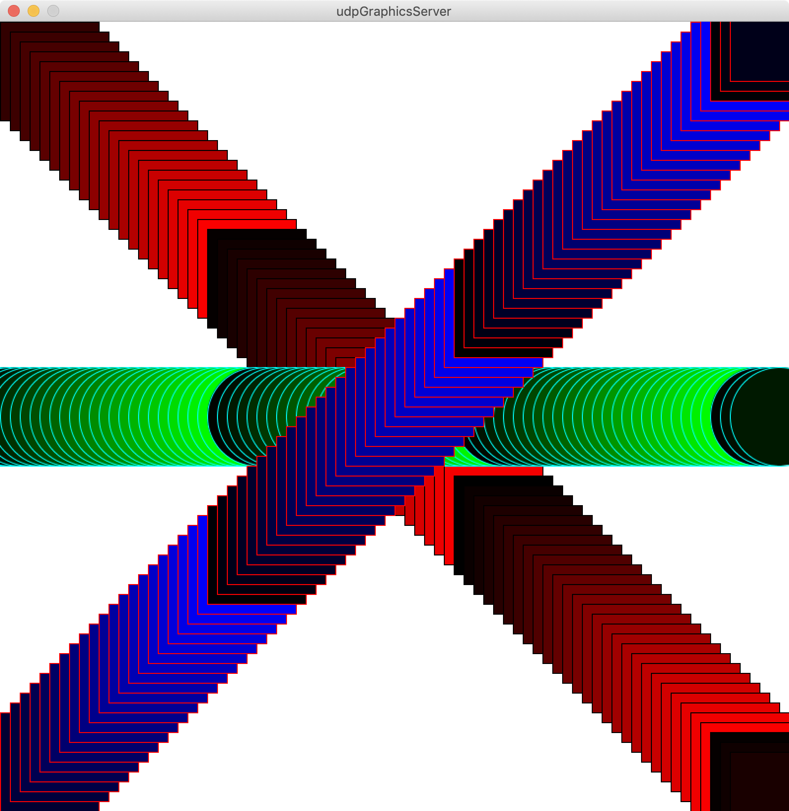

# udp_graphics_server
UDP packet based graphics server for command based programming language education  
グラフィックスの機能を持たないコマンドベースのプログラミング言語環境（例えば，CodeRunnerなど）で，UDPパケット経由でグラフィックスを表示するサーバ

## How to build
1. Open pde files on Processing (verified on 3.5.1)
1. Install "UDP" Library developed by Stephane from Contribution Manager
1. Export as Application

## How to use
Check sample.cs  
The result is  


## Interface code for C# language
```C#
using System;
using System.Threading;

// Main part (don't remove)
class graph {
	string host = "127.0.0.1";
	int    port = 10000;
	System.Net.Sockets.UdpClient udp;

	public graph(){
		udp = new System.Net.Sockets.UdpClient();
		clear();
	}
	~graph(){
		udp.Close();
	}
	void sendMsg(string msg){
		byte[] sendBytes = System.Text.Encoding.UTF8.GetBytes(msg);
		udp.Send(sendBytes, sendBytes.Length, host, port);
		Thread.Sleep(10);
	}
	public void pset( int x , int y ){
		sendMsg( string.Format( "pset {0} {1}" , x , y ));
	}
	public void clear(){
		sendMsg( string.Format( "clear" ));
	}
	public void line( int x1 , int y1 , int x2 , int y2 ){
		sendMsg( string.Format( "line {0} {1} {2} {3}" , x1 , y1 , x2 , y2 ));
	}
	public void rect( int x , int y , int w , int h ){
		sendMsg( string.Format( "rect {0} {1} {2} {3}" , x , y , w , h ));
	}
	public void oval( int x , int y , int w , int h ){
		sendMsg( string.Format( "oval {0} {1} {2} {3}" , x , y , w , h ));
	}	
	public void pcolor( int r , int g , int b ){		// Paint Color
		sendMsg( string.Format( "pcolor {0} {1} {2}" , r , g , b ));
	}
	public void lcolor( int r , int g , int b ){		// Line Color
		sendMsg( string.Format( "lcolor {0} {1} {2}" , r , g , b ));
	}
}

// calling part (modify any)
class test {
	static void Main(string[] args){
		graph g = new graph();
		g.pcolor( 255 , 0 , 0 );        // RED
		g.rect( 100 , 100 , 100 , 100); // a rectangle
	}
}

```
